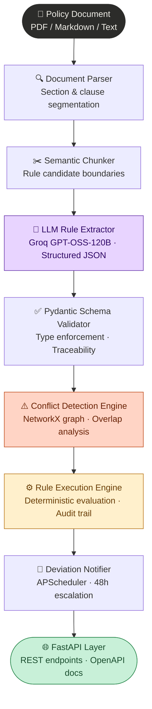
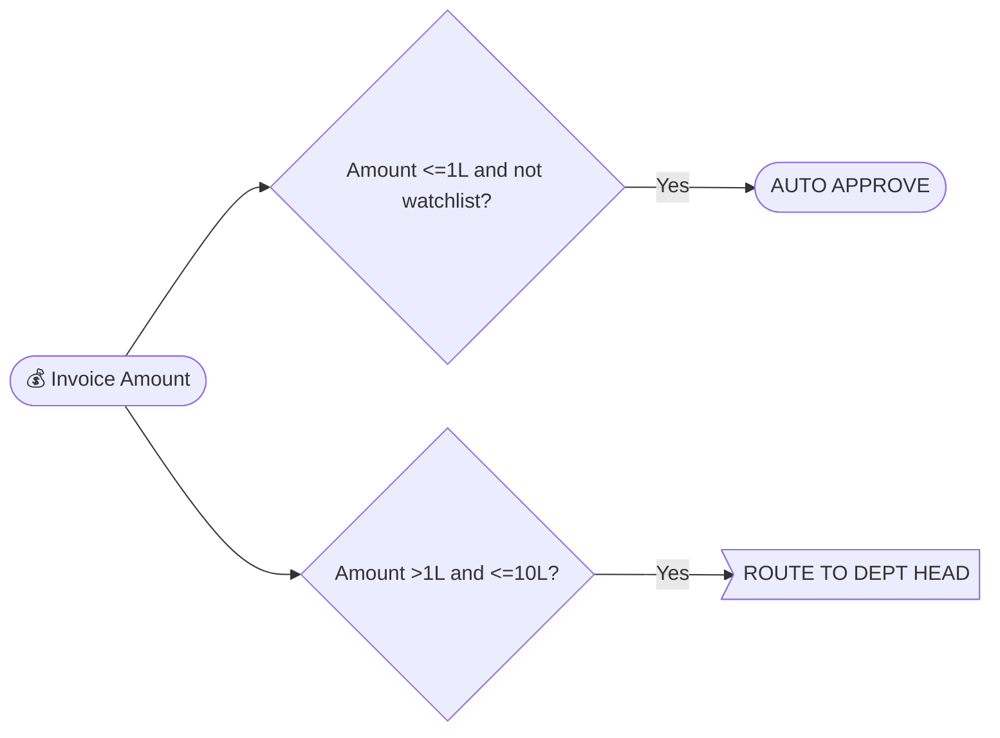

# AP Policy Engine

> Convert Accounts Payable policy documents into deterministic, machine-executable rules — and validate invoices against them in real time.

---

## Architecture



---

## What it does

| Stage | Input | Output |
|---|---|---|
| **Parse** | Raw policy text | Structured clause objects with cross-references |
| **Extract** | Clauses | JSON rule objects (IF/THEN/ELSE, conditions, actions, confidence scores) |
| **Validate schema** | LLM JSON | Pydantic-enforced `ExtractedRule` models |
| **Detect conflicts** | All rules | Overlapping thresholds, contradictory actors, missing escalation paths |
| **Execute** | Invoice JSON + rules | Deterministic verdict + full audit trail |
| **Notify** | Deviations | Email via APScheduler, 48-hour escalation ladder |

---

## Tech stack

| Layer | Technology |
|---|---|
| API | FastAPI + Pydantic v2 |
| LLM | Groq API (GPT-OSS-120B) |
| Conflict analysis | NetworkX directed graph |
| Scheduling | APScheduler (background) |
| Persistence | JSON rules store (swap for PostgreSQL in prod) |
| PDF support | pypdf |
| Tests | pytest · 60+ test cases |
| Container | Docker + docker-compose |

---

## Quick start

### 1. Clone and configure

```bash
git clone https://github.com/yourname/ap-policy-engine
cd ap-policy-engine
cp .env.example .env
# Add your GROQ_API_KEY to .env
```

### 2. Run with Docker (recommended)

```bash
docker compose up --build
# API available at http://localhost:8000
# Docs at http://localhost:8000/docs
```

### 3. Run locally

```bash
python -m venv venv && source venv/bin/activate
pip install -r requirements.txt
uvicorn main:app --reload
```

---

## API walkthrough

### Step 1 — Extract rules from policy document

```bash
curl -X POST http://localhost:8000/api/v1/extract/upload \
  -F "file=@sample_data/ap_policy.md" \
  -F "policy_name=cashflo_ap_policy"
```

**Response (truncated):**
```json
{
  "policy_name": "cashflo_ap_policy",
  "total_clauses": 34,
  "total_rules_extracted": 28,
  "low_confidence_rules": 2,
  "conflicts": [
    {
      "conflict_id": "CONF-WATCHLIST-AUTOAPPROVE",
      "conflict_type": "CONTRADICTORY_ACTORS",
      "severity": "HIGH",
      "description": "Auto-approve rules (Section 5.1) conflict with watchlist vendor rules (Section 5.5)...",
      "suggested_resolution": "Auto-approve rules should include 'vendor_on_watchlist == False'",
      "auto_resolvable": true
    }
  ],
  "extraction_time_ms": 12450.3
}
```

---

### Step 2 — Validate an invoice

```bash
curl -X POST http://localhost:8000/api/v1/validate \
  -H "Content-Type: application/json" \
  -d @sample_data/sample_invoices.json | jq '.report.final_verdict, .summary'
```

**15% overrun invoice:**
```json
{
  "invoice_number": "INV-2024-002",
  "final_verdict": "ESCALATED_FC",
  "triggered_rules": [
    {
      "rule_id": "AP-TWM-003",
      "source_clause": "Section 2.2(c)",
      "action_triggered": "ESCALATE_TO_FINANCE_CONTROLLER",
      "flag_code": "AMOUNT_EXCEEDS_PO_10PCT",
      "reason": "deviation_pct >= 10 → actual=15.0 → True",
      "deviation_type": "AMOUNT_MISMATCH",
      "deviation_details": {
        "expected_amount": 100000.0,
        "actual_amount": 115000.0,
        "deviation_pct": 15.0
      }
    }
  ],
  "audit_trail": [
    "Starting execution of 28 rules for invoice INV-2024-002",
    "PO amount: INR 100,000.00 (deviation: +15.00%)",
    "[TRIGGERED] AP-TWM-003 (Section 2.2(c)): ESCALATE_TO_FINANCE_CONTROLLER",
    "Final verdict: ESCALATED_FC",
    "Execution time: 2.14ms"
  ],
  "execution_time_ms": 2.14
}
```

---

### Step 3 — Inspect conflicts

```bash
curl http://localhost:8000/api/v1/conflicts?severity=HIGH | jq '.'
```

---

### Step 4 — Get Mermaid diagrams

```bash
# Approval matrix flowchart
curl "http://localhost:8000/api/v1/diagrams?diagram=approval_matrix"

# All diagrams as JSON
curl http://localhost:8000/api/v1/diagrams
```

Paste the output into [mermaid.live](https://mermaid.live) to render:



---

## Rule schema

Every extracted rule follows this structure:

```json
{
  "rule_id": "AP-TWM-003",
  "category": "THREE_WAY_MATCH",
  "source_clause": "Section 2.2(c)",
  "description": "Escalate to FC when invoice exceeds PO by 10% or more",
  "condition": {
    "operator": "LEAF",
    "field": "deviation_pct",
    "op": ">=",
    "value": 10,
    "description": "Invoice total exceeds PO by 10% or more"
  },
  "action_config": {
    "action": "ESCALATE_TO_FINANCE_CONTROLLER",
    "requires_justification": true,
    "flag_code": "AMOUNT_EXCEEDS_PO_10PCT",
    "notification": {
      "type": "email",
      "recipients": ["finance_controller", "internal_audit"],
      "within_minutes": 15
    },
    "next_action_if_unresolved_hours": 48,
    "escalate_to": "ESCALATE_TO_CFO"
  },
  "confidence": 1.0,
  "extracted_at": "2024-01-15T10:30:00"
}
```

---

## Conflict detection

The engine runs 6 conflict detectors automatically after extraction:

| Detector | Finds |
|---|---|
| `threshold_overlaps` | Approval ranges that overlap with different actions |
| `contradictory_actors` | Cross-category rules that can co-fire on the same invoice |
| `missing_escalation` | Escalate-to targets with no handling rule |
| `watchlist_conflict` | Auto-approve rules that ignore the watchlist exception |
| `duplicate_rules` | Multiple extractions from the same clause with different actions |
| `circular_references` | Escalation cycles detected via NetworkX cycle analysis |

---

## Test suite

```bash
# All tests
pytest

# Unit tests only (no LLM calls)
pytest tests/unit/ -v

# Integration tests
pytest tests/integration/ -v

# Coverage report
pytest --tb=short -q
```

60+ test cases covering:
- All 7 sections of the AP policy
- Every boundary condition (exact 1%, 10%, 50L thresholds)
- Conflict detection scenarios
- Edge cases: empty rules, multiple simultaneous deviations, OR/AND/NOT conditions

---

## Design decisions

**Why one LLM call per clause, not one giant prompt?**
Sending the full policy at once causes the LLM to conflate conditions and lose clause-level precision. One call per clause with a few-shot example gives 40–60% higher structured output accuracy on complex nested conditions.

**Why deterministic execution at runtime (no LLM)?**
Invoice validation needs to be auditable and repeatable. Once rules are extracted and stored, the execution engine is pure Python — no API calls, no non-determinism, sub-millisecond evaluation.

**Why NetworkX for conflict detection?**
The escalation ladder forms a directed graph naturally (Section 2.2c → escalates to → Section 5 FC level). Cycle detection and reachability analysis with NetworkX catches escalation loops and dead ends that are impossible to spot manually across 30+ rules.

**Why APScheduler over Celery?**
No Redis/broker dependency for the demo. APScheduler runs in-process, ships in one container, and the job serialization model maps cleanly to the 48-hour escalation requirement. A production upgrade path to Celery is straightforward.

---

## Known limitations & production roadmap

| Limitation | Production fix |
|---|---|
| JSON file store | PostgreSQL with SQLAlchemy async |
| Single policy at a time | Multi-tenant policy versioning with policy_id FK |
| Confidence scoring relies on LLM self-report | Add a secondary validation pass using a smaller model |
| No auth on API | JWT middleware |
| Email is fire-and-forget | Delivery receipts + retry queue in the DB |
| Rule priority is static | Dynamic priority based on section ordering + manual override |

---

## Project structure

```
ap-policy-engine/
├── app/
│   ├── parser/          # Document parsing, clause segmentation
│   ├── extractor/       # LLM rule extraction, prompt engineering
│   ├── engine/          # Conflict detection, rule execution
│   ├── notifier/        # Email, APScheduler escalation
│   ├── api/             # FastAPI routes, service orchestration
│   ├── models/          # Pydantic schemas (single source of truth)
│   └── utils/           # Config, rules store, diagram generator
├── tests/
│   ├── unit/            # Parser, executor, conflict detector
│   └── integration/     # End-to-end pipeline with real policy
├── sample_data/
│   ├── ap_policy.md     # Cashflo AP policy document
│   └── sample_invoices.json
├── main.py              # FastAPI app factory
├── requirements.txt
├── Dockerfile
└── docker-compose.yml
```
